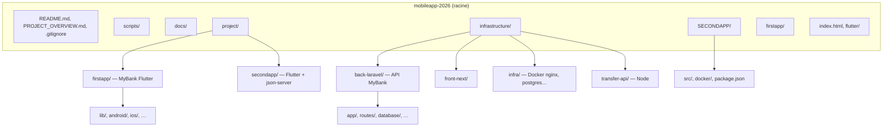

# Arbre du dépôt `mobileapp-2026`

Ce document donne une **vue d’ensemble hiérarchique** du projet (comme un arbre généalogique des dossiers).  
Les dossiers **générés** ou **trop volumineux** sont omis : `node_modules`, `.dart_tool`, `build`, `dist`, `.git`, caches, etc.

Pour une liste **exhaustive** de fichiers sur ta machine (Windows) :

```powershell
cd c:\Users\titou\mobileapp-2026
tree /F /A > arborescence-complete.txt
```

## 1. Schéma des « branches » principales (Mermaid)



---

## 2. Arbre ASCII (dossiers et fichiers clés)

```
mobileapp-2026/
├── README.md                      # Vue d’ensemble du monorepo (à lire en premier)
├── PROJECT_OVERVIEW.md            # Synthèse projet / sécu / stack
├── .gitignore
├── index.html                     # Fichier racine (hors flux principal)
├── flutter/                       # Ressources / config Flutter à la racine (si présent)
│
├── docs/                          # Documentation transverse
│   ├── ARBRE-DU-DEPOT.md          # Ce fichier
│   └── guides/                    # Guides « pour débutant »
│       ├── LIRE-MOI-GUIDES.md
│       ├── 01-MyBank-Flutter-et-Laravel.md
│       ├── 02-SECONDAPP-Web-bancaire-et-facturation.md
│       └── 03-SecondApp-Flutter-json-server.md
│
├── scripts/                       # Automatisation Windows (PowerShell)
│   ├── run_web.ps1                # Laravel + Flutter Web
│   ├── run_emulator.ps1           # Laravel + émulateur Android
│   ├── reset_db.ps1
│   └── test_transfer.ps1
│
├── project/                       # Applications Flutter « principales » du cours / portfolio
│   ├── firstapp/                  # MyBank — Flutter + API Laravel
│   │   ├── lib/                   # Code Dart (écrans, services…)
│   │   ├── android/, ios/, web/, windows/, linux/, macos/
│   │   ├── pubspec.yaml
│   │   └── test/
│   └── secondapp/                 # SecondApp — Flutter + données Docker (json-server)
│       ├── lib/
│       │   ├── main.dart
│       │   ├── config/
│       │   ├── models/
│       │   ├── screens/
│       │   └── services/
│       ├── pubspec.yaml
│       └── test/
│
├── SECONDAPP/                     # 2ᵉ app web (refonte) — Vite + React
│   ├── README.md
│   ├── package.json
│   ├── vite.config.ts
│   ├── docker-compose.yml
│   ├── docker/
│   │   └── db.json                # Données mock (dashboard + facturation)
│   ├── docs/                      # Rapport d’utilisation SECONDAPP
│   ├── scripts/
│   │   └── build-report-html.mjs
│   └── src/
│       ├── main.tsx
│       ├── app/
│       │   ├── App.tsx
│       │   ├── routes.tsx
│       │   ├── contexts/
│       │   ├── components/        # Dashboard, Transferts, Facturation, UI…
│       │   └── services/          # dashboardApi, invoicingApi, persistance…
│       └── styles/
│
├── infrastructure/                # Backends & infra
│   ├── back-laravel/              # API REST MyBank (PHP / Laravel)
│   │   ├── app/
│   │   ├── bootstrap/
│   │   ├── config/
│   │   ├── database/              # migrations, seeders, SQLite…
│   │   ├── public/
│   │   ├── routes/
│   │   ├── composer.json
│   │   └── Dockerfile
│   ├── front-next/                # Front Next.js (Docker / infra)
│   ├── infra/
│   │   ├── docker-compose.yml     # Postgres, Laravel, Nginx, Next…
│   │   └── nginx.conf
│   └── transfer-api/              # API Node (transferts / démo)
│       ├── package.json
│       └── …
│
└── firstapp/                      # Copie / ancien emplacement Flutter (si utilisé)
    └── …                          # Même type de structure que project/firstapp
```

---

## 3. Correspondance rapide « je cherche… »

| Tu veux… | Dossier / fichier |
|----------|-------------------|
| Lancer MyBank (Flutter + Laravel) | `project/firstapp` + `infrastructure/back-laravel` |
| Lancer l’app web bancaire + facturation | `SECONDAPP` |
| Lancer Flutter + json-server (port 3001) | `project/secondapp` + Docker dans `SECONDAPP` (même `db.json` concept) |
| API Laravel seule | `infrastructure/back-laravel` |
| Docker « stack complète » (Postgres, etc.) | `infrastructure/infra` |
| Scripts PowerShell tout-en-un | `scripts/run_web.ps1`, `run_emulator.ps1` |
| Données mock SECONDAPP | `SECONDAPP/docker/db.json` |
| Guides pas à pas débutant | `docs/guides/` |

---

*Document généré pour le dépôt mobileapp-2026.*
