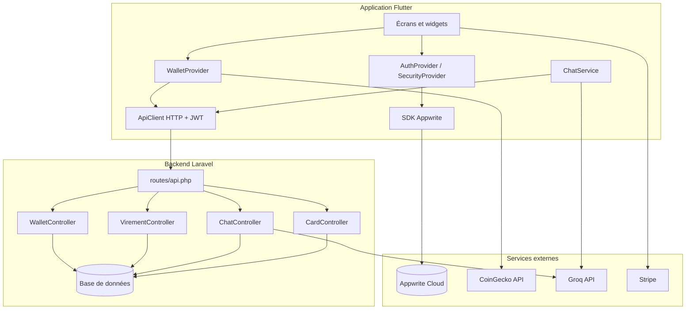

# Rapport de projet — NodEX (portefeuille crypto)

**Auteur :** meranville  
**Dépôt :** [mobileapp-2026](https://github.com/roor-killa/mobileapp-2026) — branche **`meranville`**  
**Chemin du projet dans le dépôt :** `project/crypto-wallet/`  
**Date du rapport :** mars 2026  

---

## 1. Résumé

J’ai développé **NodEX**, une application mobile de type **portefeuille crypto** avec des fonctions financières (soldes, envoi, historique, virements en euros, carte virtuelle côté API), une **authentification** gérée par **Appwrite**, un **assistant conversationnel** via **Groq**, et des paiements intégrés avec **Stripe** (SDK Flutter). Le tout s’appuie sur une **API REST Laravel** exposée sous `/api`. Les **cours des cryptos** affichés à l’écran proviennent de l’**API publique CoinGecko** (appelée depuis l’app Flutter). Ce document présente le travail réalisé, des **captures d’écran**, l’**architecture**, le **fonctionnement des API**, des **extraits de code expliqués**, ce qui manque pour une **mise à disposition du grand public**, et les **sources** qui m’ont aidé.

---

## 2. Contexte et objectifs

- **Contexte :** projet mobile dans le cadre du cours / dépôt partagé L3 (application mobile 2026).  
- **Objectif initial :** disposer d’une application utilisable en **local** (simulateur ou téléphone) connectée à un **backend** documenté.  
- **Périmètre :** prototype avancé / **preuve de concept** orientée fintech, **pas** un produit bancaire agréé.

---

## 3. Description de la solution

### 3.1 Vue d’ensemble

| Couche | Technologie | Rôle |
|--------|-------------|------|
| Mobile | **Flutter** (Dart) | Interface, navigation, appels HTTP, intégration Appwrite / Stripe |
| Backend | **Laravel** (PHP) | API JSON, virements, chat Groq, données carte / portefeuilles côté serveur |
| Auth | **Appwrite** | Inscription, connexion, JWT |
| IA | **Groq** | Complétions pour l’assistant (modèle type Llama 3.1 instantané) |
| Cours crypto | **CoinGecko** (API HTTP) | Prix en EUR et variation 24h (appel depuis `WalletProvider`) |
| Paiements | **Stripe** | Intégration côté app (clé publique, flux prévus dans le projet) |

### 3.2 Arborescence utile

- `flutter_app/` — code source Flutter (`pubspec.yaml`, `lib/`, scripts `run_ios_sim.sh`).  
- `backend-laravel/` — API Laravel (`routes/api.php`, contrôleurs, migrations, `.env.example`).  
- `docs/rapport-captures/` — captures d’écran jointes à ce rapport (fichiers PNG).  
- Documentation complémentaire : `README.md` (racine du dépôt), `STRIPE_SETUP.md`, `MIGRATION_VIREMENTS.md`, `VIREMENTS_AUDIT.md`, etc.

### 3.3 Dépendances Flutter principales

`http`, `provider`, `appwrite`, `flutter_stripe`, `flutter_secure_storage`, `local_auth`, `shared_preferences`, `crypto`, `qr_flutter`, `animations`, `cupertino_icons`.

---

## 4. Captures d’écran de l’application

Les images suivantes illustrent les principaux écrans de NodEX (simulateur iPhone, mars 2026). Elles sont stockées dans le dépôt sous `docs/rapport-captures/`.

### 4.1 Connexion

Écran d’accueil non connecté : marque **NodEX**, slogan, onglets de méthode de connexion (email, code, SMS, lien), champs email / mot de passe, lien d’inscription. L’authentification réelle passe par **Appwrite**.

### 4.2 Accueil — tableau de bord

Après connexion : salutation avec le prénom, notifications, carrousel (assistant intelligent, heure locale analogique/numérique), **solde total** en euros, aperçu des portefeuilles (EUR, BTC, etc.), barre d’onglets et bouton flottant **Assistant**.

### 4.3 Accueil — liste des actifs

Liste des cryptos avec **prix en euros**, variation 24h, solde utilisateur ; bloc **Dernières transactions** (virements reçus / envoyés avec pseudonyme) ; bouton **Assistant**.

### 4.4 Portefeuilles (« Mes portefeuilles »)

Carte **valeur totale** (crypto + EUR), raccourcis Recevoir / Envoyer / Swap / Acheter / Historique, liste **Vos actifs** avec adresse, cours et actions.

### 4.5 Historique

Filtres Tout / Envoyés / Reçus / Échanges ; transactions groupées par date ; montants colorés (+ / -) ; navigation par onglets.

### 4.6 Carte virtuelle

Carte type **VISA** avec gradient, **4 derniers chiffres**, titulaire, date d’expiration ; actions **Bloquer** et **Numéro & CVV** (données sensibles gérées avec précaution côté app).

### 4.7 Réglages

Profil (initiale, pseudo, email), **Serveur & assistant (IA)**, Ondes, devise EUR, thème sombre, notifications, sécurité (biométrie, déconnexion tous appareils).

### 4.8 Assistant NodEX (IA)

Conversation avec l’assistant : champ de saisie, envoi vers le backend **ou** secours Groq direct selon configuration (voir section 7).

---

## 5. Architecture du projet

### 5.1 Schéma global

L’application suit une architecture **client — serveur** : le mobile Flutter consomme l’API Laravel en JSON, s’authentifie via Appwrite, et appelle des services externes (CoinGecko, Groq, Stripe) soit **depuis le téléphone**, soit **via le serveur** (Groq depuis Laravel pour garder la clé secrète et injecter le contexte compte).

### 5.2 Navigation dans l’app Flutter

Le fichier `lib/app.dart` définit la logique d’affichage :

1. **Splash** d’ouverture (`NodexOpeningSplash`).  
2. Si chargement auth → `LoadingScreen`.  
3. Si récupération mot de passe → `UpdatePasswordScreen`.  
4. Si email non vérifié → `EmailVerificationPendingScreen`.  
5. Si non connecté → `LoginScreen`.  
6. Si verrouillage PIN / biométrie → `AppLockScreen`.  
7. Sinon → **`HomeTabs`** : cinq onglets (`DashboardScreen`, `WalletsScreen`, `HistoryScreen`, `CardScreen`, `SettingsScreen`) avec `PageTransitionSwitcher` + `BottomNavigationBar`, fond `FuturisticBackground`, et un **FAB « Assistant »** qui ouvre `ChatScreen`.

### 5.3 Couches côté Laravel

- **Routes** : `routes/api.php` enregistre les URL sous le préfixe `/api` (souvent monté par `bootstrap/app.php`).  
- **Contrôleurs** : logique métier (virements, carte, chat, wallets).  
- **Trait `ResolvesNodexUser`** : lit le JWT Bearer, extrait l’identifiant Appwrite, charge la ligne `NodexUser` en base.  
- **Modèles** : `NodexUser`, `VirementEur`, `UserCard`, etc.

---

## 6. API REST — liste et fonctionnement

Toutes les URL ci-dessous sont relatives à la **base API** configurée dans l’app, par exemple `http://127.0.0.1:8000/api`. Les routes **protégées** attendent un en-tête :

`Authorization: Bearer <JWT Appwrite>`.

| Méthode | Chemin | Rôle |
|---------|--------|------|
| `GET` | `/health` | Vérifier que le serveur répond (`ok`, horodatage). |
| `GET` | `/debug/auth` | **Debug uniquement** : indique si un Bearer est présent et décode le payload JWT (à **supprimer en production**). |
| `GET` | `/wallets` | Liste des portefeuilles crypto (ETH, BTC, SOL, ALGO) : symbole, blockchain, adresse dérivée, solde (cache serveur ou 0). |
| `GET` | `/card` | Détail carte virtuelle (création si besoin) : numéro formaté, last4, expiration, CVV, PIN, titulaire. |
| `POST` | `/chat/groq` | Corps JSON : `messages`, optionnellement `model`, `temperature`, `max_tokens`. Le serveur enrichit le contexte système avec solde EUR, IBAN, pseudonyme, cryptos, derniers virements, puis appelle **Groq**. |
| `GET` | `/virements/balance` | Solde euro du compte NodEX (`balanceEur`). |
| `GET` | `/virements/me` | Infos bancaires synthétiques : solde, IBAN, pseudonyme, titulaire. |
| `GET` | `/virements/history` | Historique fusionné envoyés/reçus (limite côté serveur). |
| `POST` | `/virements/send` | Envoi d’un virement interne (montant, destinataire identifié par pseudonyme ou id selon implémentation du contrôleur). |

### 6.1 Chaîne d’authentification JWT → utilisateur Laravel

1. L’utilisateur se connecte avec **Appwrite** dans Flutter.  
2. L’app récupère un **JWT** (ou token stocké en secours dans `SharedPreferences`).  
3. `ApiClient` ajoute `Authorization: Bearer …` à chaque requête vers Laravel.  
4. Le trait **`ResolvesNodexUser`** décode le **payload** du JWT (deuxième segment en base64), lit `userId`, `sub` ou champs imbriqués, puis fait `NodexUser::where('appwriteId', …)->first()`.  
5. Si aucune ligne : réponses **401** ou message d’erreur métier.

### 6.2 Flux assistant IA (Groq)

- **Mode recommandé :** Flutter envoie `POST /api/chat/groq` → Laravel ajoute les **données réelles du compte** dans le message système (pour limiter les inventions du modèle) → Laravel appelle `https://api.groq.com/openai/v1/chat/completions` avec **`GROQ_API_KEY`** dans `.env`.  
- **Mode secours :** si le serveur est indisponible, sans clé, ou erreur réseau, `ChatService` peut appeler Groq **directement** depuis l’app si une clé est saisie dans les réglages (moins idéal pour la confidentialité de la clé).

### 6.3 Prix des cryptomonnaies

- **Pas** calculés par Laravel dans `WalletController` pour l’affichage marché.  
- Le **`WalletProvider`** (Flutter) appelle **CoinGecko** (`simple/price` en EUR + `include_24hr_change`) pour remplir `_prices` et `_changes24h`, puis combine avec les soldes renvoyés par `GET /api/wallets`.

---

## 7. Explication de code clé

### 7.1 `ApiClient` — client HTTP unique avec JWT

Fichier : `flutter_app/lib/services/api_client.dart`.

- **Singleton** (`factory ApiClient()`) : une seule instance pour toute l’app.  
- **`_getToken()`** : priorité au token **Appwrite** via `AuthServiceAppwrite`, sinon valeur stockée localement (`jwt_token`).  
- **`_headers()`** : ajoute `Content-Type: application/json` et `Authorization: Bearer …` si demandé.  
- **`get` / `post`** : construisent l’URL avec `ApiConfig.baseUrl` + chemin (ex. `/virements/history`), timeout 15 s. Un **401** ne vide pas brutalement la session : le commentaire indique qu’on peut resynchroniser le JWT avec Appwrite.

### 7.2 `ApiConfig` — URL de l’API

Fichier : `flutter_app/lib/config/api_config.dart`.

- Ordre : **URL enregistrée dans Réglages** → variable de compilation `API_BASE_URL` → défauts (`127.0.0.1:8000/api` sur iOS/desktop, `10.0.2.2` sur émulateur Android).  
- **`_normalizeApiBase`** : garantit que l’URL se termine par `/api`.

### 7.3 `ResolvesNodexUser` — qui est l’utilisateur côté API ?

Fichier : `backend-laravel/app/Http/Controllers/Concerns/ResolvesNodexUser.php`.

- Découpe le header `Authorization`, extrait le JWT, décode le payload JSON.  
- Cherche l’identifiant Appwrite dans `userId`, `sub`, `$id`, ou sous-objet `user`.  
- Retourne le modèle **`NodexUser`** lié à `appwriteId`. Tous les contrôleurs métier utilisent ce trait pour rester cohérents.

### 7.4 `ChatController` — proxy Groq + contexte compte

Fichier : `backend-laravel/app/Http/Controllers/ChatController.php`.

- Vérifie l’utilisateur et la présence de **`GROQ_API_KEY`**.  
- **`injectLiveAccountContext`** : fusionne un bloc texte (solde EUR, nom, pseudo, IBAN, soldes crypto depuis le cache, derniers virements) dans le message **system** envoyé au modèle.  
- Objectif documenté dans le code : l’IA ne doit **pas inventer** soldes ou IBAN pour ce compte.

### 7.5 `VirementController` — virements internes EUR

Fichier : `backend-laravel/app/Http/Controllers/VirementController.php`.

- `balance` / `me` : lecture du solde et des infos affichables type RIB.  
- `history` : fusionne envois et réceptions, résout les **pseudonymes** des contreparties, trie par date.  
- `send` : transaction en base (débit/crédit) sous contraintes de solde (suite du fichier non citée ici ligne par ligne).

### 7.6 `WalletController` — portefeuilles crypto

Fichier : `backend-laravel/app/Http/Controllers/WalletController.php`.

- Pour chaque symbole (ETH, BTC, SOL, ALGO), construit un objet avec **adresse déterministe** (hash SHA256 du couple `userId` + symbole avec préfixe bc1/0x selon la chaîne).  
- Les **soldes** viennent du **cache** Laravel `nodex_crypto_{userId}` ou sont à zéro par défaut.

### 7.7 `CardController` — carte virtuelle

Fichier : `backend-laravel/app/Http/Controllers/CardController.php`.

- Si aucune ligne `UserCard` : génération numéro (avec contrôle type **Luhn** dans la suite du fichier), date d’expiration, CVV, PIN, association au `userId`.

### 7.8 `ChatService` — stratégie double (Laravel puis direct)

Fichier : `flutter_app/lib/services/chat_service.dart`.

- Construit l’historique des messages (limite des derniers tours).  
- Tente d’abord **`POST /chat/groq`** via `ApiClient`.  
- Si **401**, **503**, erreurs serveur ou **réseau**, tente **Groq direct** avec `GroqDirectConfig.effectiveKey` et un message système incluant éventuellement un **contexte local** passé depuis l’UI.

### 7.9 `WalletProvider` — agrégation CoinGecko + API + virements

Fichier : `flutter_app/lib/providers/wallet_provider.dart`.

- **`_fetchPricesFromCoinGecko`** : requête GET vers l’API CoinGecko, met à jour prix EUR et variation 24h.  
- **`fetch`** : charge les wallets via l’API Laravel et fusionne l’**historique des virements** dans la liste des transactions affichées sur l’accueil et l’historique (`_mergeVirementsIntoTransactions`).

---

## 8. Méthode et mise en œuvre

1. Mise en place du backend Laravel (`.env`, Composer, migrations, `php artisan serve`).  
2. Développement de l’app Flutter et connexion à l’API (`API_BASE_URL` via `--dart-define` ou réglages in-app).  
3. Configuration Appwrite et variables sensibles **hors dépôt** (fichier `.env` ignoré par Git).  
4. Tests manuels sur simulateur iOS / appareil réel (réseau local, URL du Mac).  
5. Versionnement Git et push sur la branche **`meranville`**.

---

## 9. Ce qui manque pour un déploiement « grand public »

Ce projet est adapté au **développement et à la démonstration**. Pour une **publication large** (stores, utilisateurs inconnus, charge réelle), il faudrait notamment :

### 9.1 Produit et conformité

- **Statut légal :** services de paiement, crypto et « banking » sont **réglementés** (ex. Europe : DSP2, AML, licences selon l’activité). Un prototype étudiant **ne remplace pas** un cadre juridique ni un établissement agréé.  
- **CGU / politique de confidentialité / RGPD :** textes validés, base légale du traitement des données, droits utilisateurs, DPO si nécessaire.  
- **Mentions « démo / non régulé »** si l’app reste un projet pédagogique accessible publiquement.

### 9.2 Sécurité

- Supprimer **`/api/debug/auth`** et tout endpoint de debug en production.  
- **HTTPS** obligatoire partout (API, Appwrite, callbacks).  
- Secrets uniquement en variables d’environnement **serveur** ; rotation des clés ; principe du moindre privilège.  
- Revue des en-têtes CORS, limitation du débit (**rate limiting**), validation **cryptographique** du JWT (au-delà du simple décodage base64 utilisé pour résoudre l’utilisateur — en production il faut vérifier la signature avec les clés Appwrite).  
- Audit de sécurité (OWASP Mobile / API) et tests d’intrusion pour un vrai lancement.

### 9.3 Infrastructure

- Hébergement **géré** (serveur, base de données, sauvegardes, monitoring, logs centralisés).  
- **CI/CD** (tests automatiques, build signé iOS/Android).  
- **Scalabilité** (file d’attente pour tâches longues, cache si besoin).

### 9.4 Qualité et maintenance

- **Tests automatisés** (unitaires, intégration API, tests widget Flutter).  
- Gestion des **versions**, changelog, canal de **support** utilisateur.  
- **Accessibilité** (a11y) et **internationalisation** (i18n) si public multilingue.

### 9.5 Stores (Apple App Store, Google Play)

- Comptes développeur payants, fiches conformes aux guidelines, captures d’écran, politique de confidentialité hébergée en URL publique.  
- Déclaration des **achats intégrés** / Stripe selon les règles de chaque store.  
- Build **signé**, provisioning iOS, Android App Bundle.

### 9.6 Opérations financières réelles

- Compte **Stripe** (ou autre PSP) en mode **live**, webhooks sécurisés, conformité **PCI** (ne jamais stocker PAN en clair).  
- KYC / lutte contre la fraude si encaissement ou comptes utilisateurs réels.

En résumé : le travail actuel constitue une **base technique solide pour un projet universitaire** ; le passage au **grand public** implique juridique, sécurité, exploitation et qualité logicielle bien au-delà du périmètre d’un cours.

---

## 10. Difficultés rencontrées (exemples types)

- Faire coïncider l’**URL de l’API** entre simulateur, téléphone physique et machine hébergeant Laravel (adresse IP locale, pare-feu).  
- Gérer l’**authentification** (JWT Appwrite) côté Laravel et côté Flutter de manière cohérente.  
- Comprendre la **structure du dépôt** (Flutter dans un sous-dossier, pas à la racine).  
- Configurer **Stripe** et **Appwrite** sans commiter de secrets (`.env`, `.gitignore`).  
- Limiter les **hallucinations** de l’IA sur les soldes grâce au **contexte injecté** côté Laravel.

*(À adapter avec mes propres anecdotes pour l’oral.)*

---

## 11. Conclusion

NodEX regroupe une **application Flutter**, une **API Laravel**, **Appwrite**, **Groq**, **CoinGecko** et **Stripe** dans une expérience de portefeuille et de services associés. Le rendu est **démontrable en local**, illustré par des **captures d’écran** dans ce rapport, et documenté dans le `README.md` du dépôt. Pour une **diffusion publique**, il reste indispensable de traiter **légal**, **sécurité**, **hébergement**, **stores** et **exploitation** comme un produit à part entière.

---

## 12. Sources, documentation et ressources utilisées

Les liens ci-dessous sont les **sources officielles ou principales** qui m’ont aidé. Les URL sont données en entier pour faciliter la vérification.

### 12.1 Frameworks et langages

| Ressource | URL |
|-----------|-----|
| Flutter — documentation | https://docs.flutter.dev/ |
| Dart — langage | https://dart.dev/ |
| Laravel — documentation | https://laravel.com/docs |
| PHP | https://www.php.net/docs.php |
| Composer (PHP) | https://getcomposer.org/doc/ |

### 12.2 Services et API externes du projet

| Ressource | URL |
|-----------|-----|
| Appwrite — documentation | https://appwrite.io/docs |
| Stripe — documentation développeurs | https://stripe.com/docs |
| Stripe — Flutter SDK (flutter_stripe) | https://pub.dev/packages/flutter_stripe |
| Groq — console / clés API | https://console.groq.com/ |
| Groq — documentation modèles API | https://console.groq.com/docs/models |
| CoinGecko — documentation API (prix crypto) | https://www.coingecko.com/en/api/documentation |

### 12.3 Packages Flutter (référence pub.dev)

| Package | URL |
|---------|-----|
| provider | https://pub.dev/packages/provider |
| http | https://pub.dev/packages/http |
| appwrite (SDK Dart) | https://pub.dev/packages/appwrite |
| flutter_secure_storage | https://pub.dev/packages/flutter_secure_storage |
| local_auth | https://pub.dev/packages/local_auth |
| shared_preferences | https://pub.dev/packages/shared_preferences |
| qr_flutter | https://pub.dev/packages/qr_flutter |
| animations | https://pub.dev/packages/animations |
| flutter_lints | https://pub.dev/packages/flutter_lints |

### 12.4 UI / design

| Ressource | URL |
|-----------|-----|
| Material Design 3 | https://m3.material.io/ |
| Panache (thème Flutter, référence dans le code) | https://github.com/rxlabz/panache |

### 12.5 Outils, versionnement, présentation

| Ressource | URL |
|-----------|-----|
| Git — documentation | https://git-scm.com/doc |
| GitHub | https://github.com/ |
| Gamma (présentations assistées par IA, si utilisé) | https://gamma.app/ |

### 12.6 Sécurité et bonnes pratiques (références générales)

| Ressource | URL |
|-----------|-----|
| OWASP Mobile Top 10 | https://owasp.org/www-project-mobile-top-10/ |
| CNIL — RGPD (information grand public) | https://www.cnil.fr/fr/rgpd-de-quoi-parle-t-on |

### 12.7 Dépôt du cours / du projet

| Ressource | URL |
|-----------|-----|
| Dépôt GitHub mobileapp-2026 | https://github.com/roor-killa/mobileapp-2026 |

---

## 13. Déclaration d’honnêteté académique

Je déclare que ce rapport décrit mon travail et que les sources externes sont citées dans la section 12. Les captures d’écran proviennent de **mon** exécution de l’application NodEX. Les extraits de code tiers respectent les licences des projets concernés.
