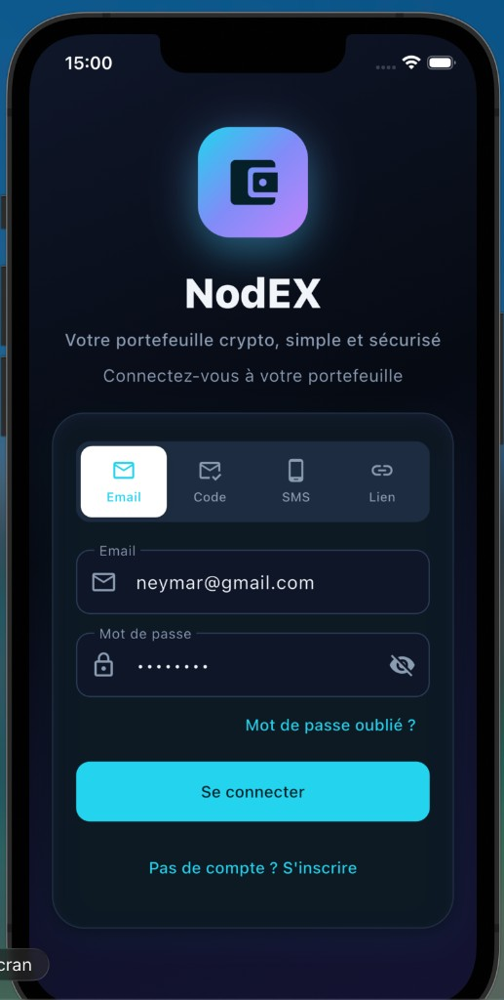
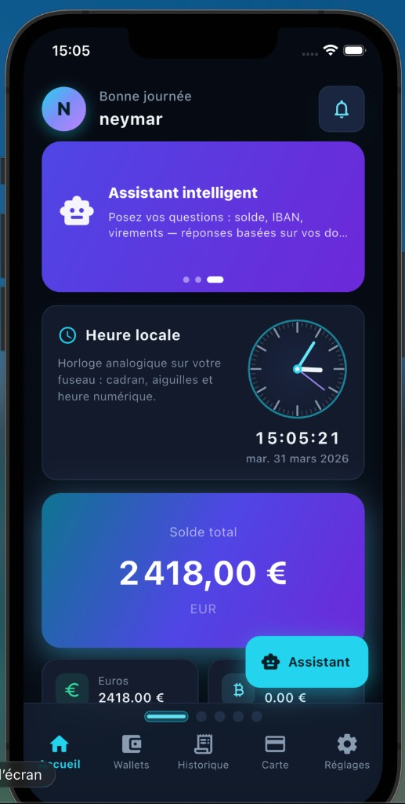
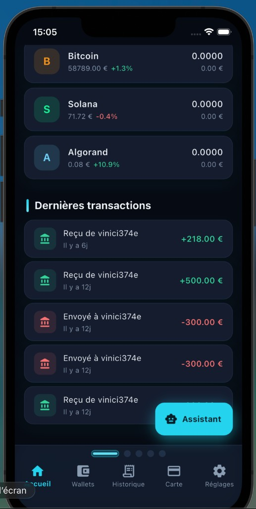
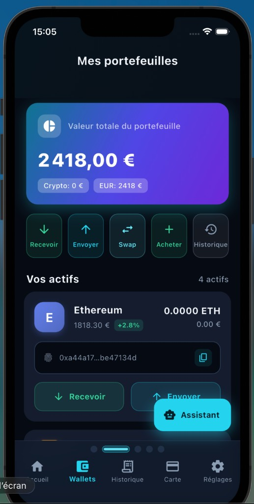
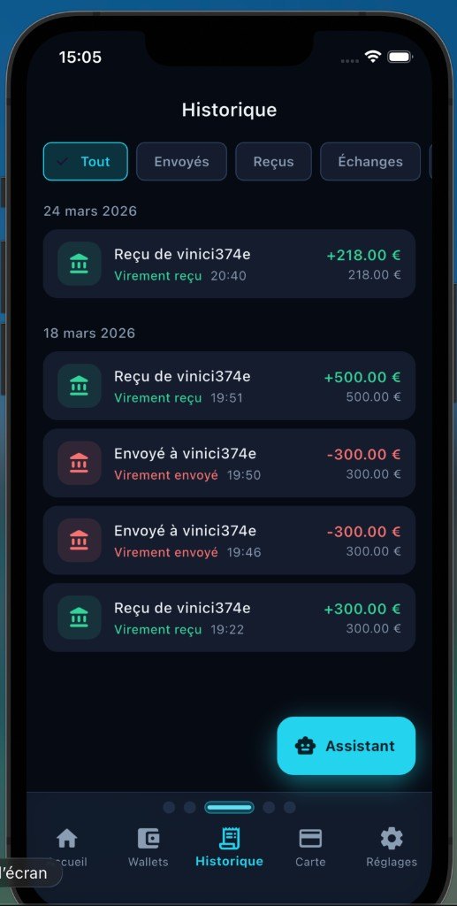
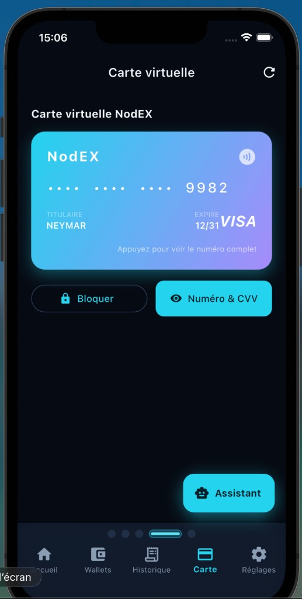
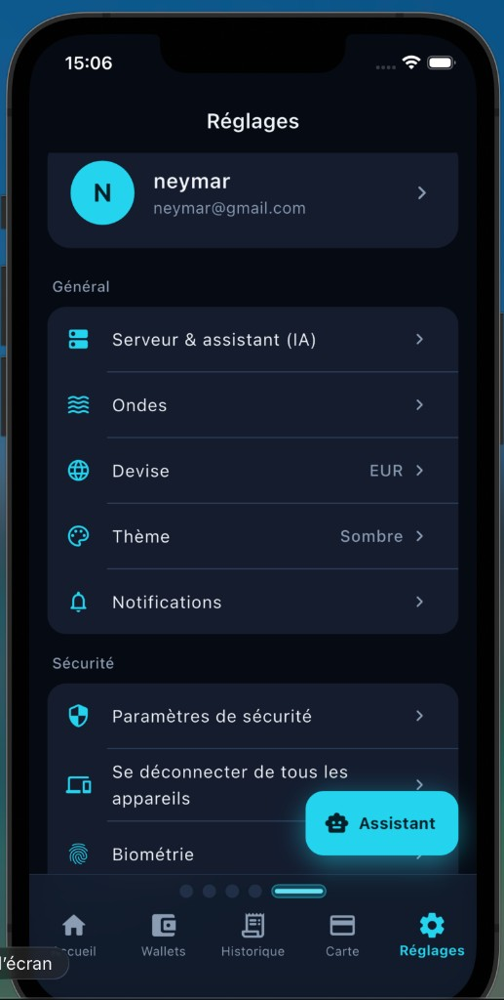
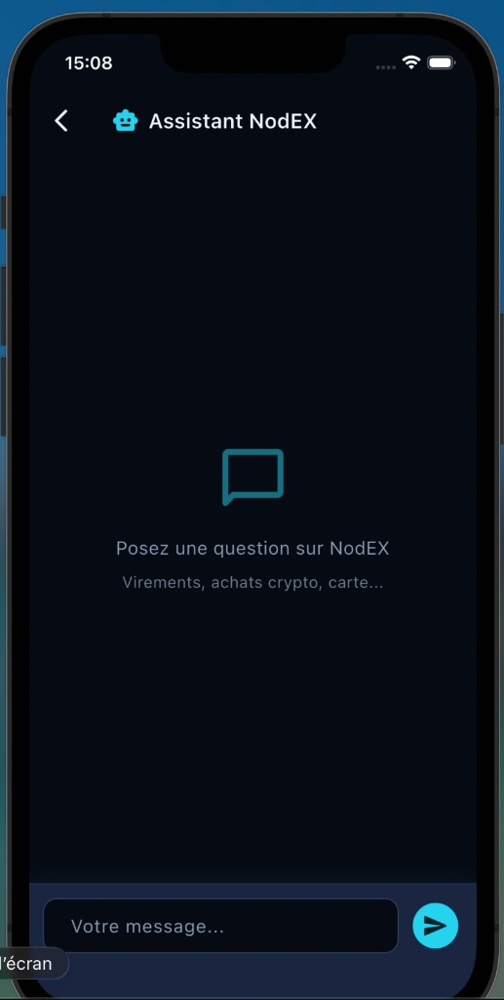
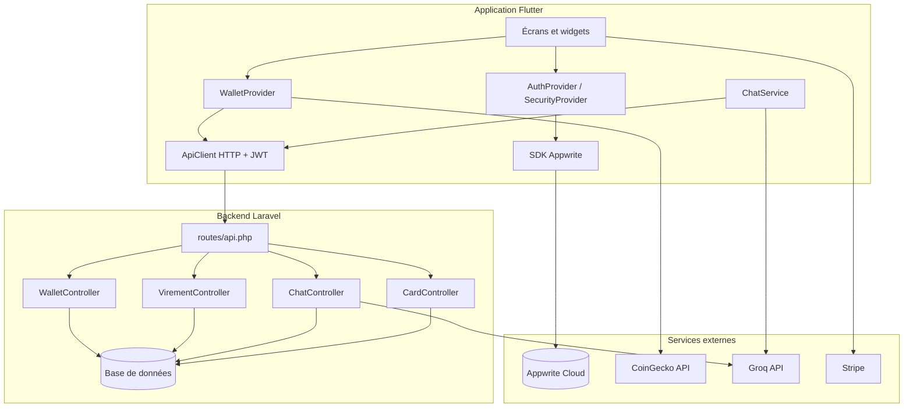

# Rapport de projet — NodEX  
### Portefeuille crypto · mobile · API · assistant IA

> **Document de rendu** — Projet dans le cadre du dépôt [mobileapp-2026](https://github.com/roor-killa/mobileapp-2026) (branche **`meranville`**).

| | |
|:---|:---|
| **Auteur** | meranville |
| **Dépôt Git** | [github.com/roor-killa/mobileapp-2026](https://github.com/roor-killa/mobileapp-2026) |
| **Code NodEX** | dossier `project/crypto-wallet/` |
| **Rapport (Markdown)** | [`RAPPORT_RENDU_NODEX.md`](RAPPORT_RENDU_NODEX.md) |
| **Captures** | dossier [`docs/rapport-captures/`](docs/rapport-captures/) |
| **Date** | mars 2026 |

---

## Sommaire {#sommaire}

*Navigation interne : les liens ci-dessous sont **cliquables** dans le **PDF** généré (Pandoc) et, selon votre lecteur Markdown, à l’écran. Pour une mise en page soignée et un sommaire pleinement actif, privilégier le fichier **`RAPPORT_RENDU_NODEX.pdf`**.*

**Introduction**
- [1. Résumé](#s1)
- [2. Contexte et objectifs](#s2)
- [3. Description de la solution](#s3)

**Interface et architecture**
- [4. Captures d’écran](#s4)
- [5. Architecture du projet](#s5)
- [6. API REST — liste et fonctionnement](#s6)
- [7. Explication détaillée du code](#s7)

**Méthode et perspectives**
- [8. Méthode et mise en œuvre](#s8)
- [9. Déploiement grand public (manques)](#s9)
- [10. Difficultés rencontrées](#s10)
- [11. Conclusion](#s11)
- [12. Sitographie et sources (liens web)](#s12)

**Fin de document**
- [Annexes](#annexes) — [A. Glossaire](#a-glossaire) · [B. Fichiers](#a-fichiers) · [C. Commandes](#a-commandes) · [D. Liens GitHub](#a-liens)
- [13. Déclaration d’honnêteté](#s13)

[↑ Haut de page](#sommaire)

---

## 1. Résumé {#s1}

J’ai développé **NodEX**, une application mobile de type **portefeuille crypto** avec des fonctions financières (soldes, envoi, historique, virements en euros, carte virtuelle côté API), une **authentification** gérée par **Appwrite**, un **assistant conversationnel** via **Groq**, et des paiements intégrés avec **Stripe** (SDK Flutter). Le tout s’appuie sur une **API REST Laravel** exposée sous `/api`. Les **cours des cryptos** affichés à l’écran proviennent de l’**API publique CoinGecko** (appelée depuis l’app Flutter). Ce document présente le travail réalisé, des **captures d’écran**, l’**architecture**, le **fonctionnement des API**, des **extraits de code expliqués**, ce qui manque pour une **mise à disposition du grand public**, et les **sources** qui m’ont aidé.

---

## 2. Contexte et objectifs {#s2}

- **Contexte :** projet mobile dans le cadre du cours / dépôt partagé L3 (application mobile 2026).  
- **Objectif initial :** disposer d’une application utilisable en **local** (simulateur ou téléphone) connectée à un **backend** documenté.  
- **Périmètre :** prototype avancé / **preuve de concept** orientée fintech, **pas** un produit bancaire agréé.

---

## 3. Description de la solution {#s3}

### 3.1 Vue d’ensemble

| Couche | Technologie | Rôle |
|--------|-------------|------|
| Mobile | **Flutter** (Dart) | Interface, navigation, appels HTTP, intégration Appwrite / Stripe |
| Backend | **Laravel** (PHP) | API JSON, virements, chat Groq, données carte / portefeuilles côté serveur |
| Auth | **Appwrite** | Inscription, connexion, JWT |
| IA | **Groq** | Complétions pour l’assistant (modèle type Llama 3.1 instantané) |
| Cours crypto | **CoinGecko** (API HTTP) | Prix en EUR et variation 24h (appel depuis `WalletProvider`) |
| Paiements | **Stripe** | Intégration côté app (clé publique, flux prévus dans le projet) |

### 3.2 Arborescence utile

- `flutter_app/` — code source Flutter (`pubspec.yaml`, `lib/`, scripts `run_ios_sim.sh`).  
- `backend-laravel/` — API Laravel (`routes/api.php`, contrôleurs, migrations, `.env.example`).  
- `docs/rapport-captures/` — captures d’écran jointes à ce rapport (fichiers PNG).  
- Documentation complémentaire : `README.md` (racine du dépôt), `STRIPE_SETUP.md`, `MIGRATION_VIREMENTS.md`, `VIREMENTS_AUDIT.md`, etc.

### 3.3 Dépendances Flutter principales

`http`, `provider`, `appwrite`, `flutter_stripe`, `flutter_secure_storage`, `local_auth`, `shared_preferences`, `crypto`, `qr_flutter`, `animations`, `cupertino_icons`.

---

## 4. Captures d’écran de l’application {#s4}

Les images suivantes illustrent les principaux écrans de NodEX (simulateur iPhone, mars 2026). Elles sont stockées dans le dépôt sous `docs/rapport-captures/`.

### 4.1 Connexion

Écran d’accueil non connecté : marque **NodEX**, slogan, onglets de méthode de connexion (email, code, SMS, lien), champs email / mot de passe, lien d’inscription. L’authentification réelle passe par **Appwrite**.



### 4.2 Accueil — tableau de bord

Après connexion : salutation avec le prénom, notifications, carrousel (assistant intelligent, heure locale analogique/numérique), **solde total** en euros, aperçu des portefeuilles (EUR, BTC, etc.), barre d’onglets et bouton flottant **Assistant**.



### 4.3 Accueil — liste des actifs

Liste des cryptos avec **prix en euros**, variation 24h, solde utilisateur ; bloc **Dernières transactions** (virements reçus / envoyés avec pseudonyme) ; bouton **Assistant**.



### 4.4 Portefeuilles (« Mes portefeuilles »)

Carte **valeur totale** (crypto + EUR), raccourcis Recevoir / Envoyer / Swap / Acheter / Historique, liste **Vos actifs** avec adresse, cours et actions.



### 4.5 Historique

Filtres Tout / Envoyés / Reçus / Échanges ; transactions groupées par date ; montants colorés (+ / -) ; navigation par onglets.



### 4.6 Carte virtuelle

Carte type **VISA** avec gradient, **4 derniers chiffres**, titulaire, date d’expiration ; actions **Bloquer** et **Numéro & CVV** (données sensibles gérées avec précaution côté app).



### 4.7 Réglages

Profil (initiale, pseudo, email), **Serveur & assistant (IA)**, Ondes, devise EUR, thème sombre, notifications, sécurité (biométrie, déconnexion tous appareils).



### 4.8 Assistant NodEX (IA)

Conversation avec l’assistant : champ de saisie, envoi vers le backend **ou** secours Groq direct selon configuration (voir [§7 Explication du code](#s7)).



---

## 5. Architecture du projet {#s5}

### 5.1 Schéma global

L’application suit une architecture **client — serveur** : le mobile Flutter consomme l’API Laravel en JSON, s’authentifie via Appwrite, et appelle des services externes (CoinGecko, Groq, Stripe) soit **depuis le téléphone**, soit **via le serveur** (Groq depuis Laravel pour garder la clé secrète et injecter le contexte compte).



### 5.2 Navigation dans l’app Flutter

Le fichier `lib/app.dart` définit la logique d’affichage :

1. **Splash** d’ouverture (`NodexOpeningSplash`).  
2. Si chargement auth → `LoadingScreen`.  
3. Si récupération mot de passe → `UpdatePasswordScreen`.  
4. Si email non vérifié → `EmailVerificationPendingScreen`.  
5. Si non connecté → `LoginScreen`.  
6. Si verrouillage PIN / biométrie → `AppLockScreen`.  
7. Sinon → **`HomeTabs`** : cinq onglets (`DashboardScreen`, `WalletsScreen`, `HistoryScreen`, `CardScreen`, `SettingsScreen`) avec `PageTransitionSwitcher` + `BottomNavigationBar`, fond `FuturisticBackground`, et un **FAB « Assistant »** qui ouvre `ChatScreen`.

### 5.3 Couches côté Laravel

- **Routes** : `routes/api.php` enregistre les URL sous le préfixe `/api` (souvent monté par `bootstrap/app.php`).  
- **Contrôleurs** : logique métier (virements, carte, chat, wallets).  
- **Trait `ResolvesNodexUser`** : lit le JWT Bearer, extrait l’identifiant Appwrite, charge la ligne `NodexUser` en base.  
- **Modèles** : `NodexUser`, `VirementEur`, `UserCard`, etc.

---

## 6. API REST — liste et fonctionnement {#s6}

Toutes les URL ci-dessous sont relatives à la **base API** configurée dans l’app, par exemple `http://127.0.0.1:8000/api`. Les routes **protégées** attendent un en-tête :

`Authorization: Bearer <JWT Appwrite>`.

| Méthode | Chemin | Rôle |
|---------|--------|------|
| `GET` | `/health` | Vérifier que le serveur répond (`ok`, horodatage). |
| `GET` | `/debug/auth` | **Debug uniquement** : indique si un Bearer est présent et décode le payload JWT (à **supprimer en production**). |
| `GET` | `/wallets` | Liste des portefeuilles crypto (ETH, BTC, SOL, ALGO) : symbole, blockchain, adresse dérivée, solde (cache serveur ou 0). |
| `GET` | `/card` | Détail carte virtuelle (création si besoin) : numéro formaté, last4, expiration, CVV, PIN, titulaire. |
| `POST` | `/chat/groq` | Corps JSON : `messages`, optionnellement `model`, `temperature`, `max_tokens`. Le serveur enrichit le contexte système avec solde EUR, IBAN, pseudonyme, cryptos, derniers virements, puis appelle **Groq**. |
| `GET` | `/virements/balance` | Solde euro du compte NodEX (`balanceEur`). |
| `GET` | `/virements/me` | Infos bancaires synthétiques : solde, IBAN, pseudonyme, titulaire. |
| `GET` | `/virements/history` | Historique fusionné envoyés/reçus (limite côté serveur). |
| `POST` | `/virements/send` | Envoi d’un virement interne (montant, destinataire identifié par pseudonyme ou id selon implémentation du contrôleur). |

### 6.1 Chaîne d’authentification JWT → utilisateur Laravel

1. L’utilisateur se connecte avec **Appwrite** dans Flutter.  
2. L’app récupère un **JWT** (ou token stocké en secours dans `SharedPreferences`).  
3. `ApiClient` ajoute `Authorization: Bearer …` à chaque requête vers Laravel.  
4. Le trait **`ResolvesNodexUser`** décode le **payload** du JWT (deuxième segment en base64), lit `userId`, `sub` ou champs imbriqués, puis fait `NodexUser::where('appwriteId', …)->first()`.  
5. Si aucune ligne : réponses **401** ou message d’erreur métier.

### 6.2 Flux assistant IA (Groq)

- **Mode recommandé :** Flutter envoie `POST /api/chat/groq` → Laravel ajoute les **données réelles du compte** dans le message système (pour limiter les inventions du modèle) → Laravel appelle `https://api.groq.com/openai/v1/chat/completions` avec **`GROQ_API_KEY`** dans `.env`.  
- **Mode secours :** si le serveur est indisponible, sans clé, ou erreur réseau, `ChatService` peut appeler Groq **directement** depuis l’app si une clé est saisie dans les réglages (moins idéal pour la confidentialité de la clé).

### 6.3 Prix des cryptomonnaies

- **Pas** calculés par Laravel dans `WalletController` pour l’affichage marché.  
- Le **`WalletProvider`** (Flutter) appelle **CoinGecko** (`simple/price` en EUR + `include_24hr_change`) pour remplir `_prices` et `_changes24h`, puis combine avec les soldes renvoyés par `GET /api/wallets`.

---

## 7. Explication détaillée du code {#s7}

Cette section décrit **à quoi sert chaque partie importante** du projet, dans l’ordre logique : démarrage de l’app Flutter, état global, appels réseau, puis chaîne Laravel (middleware → routes → contrôleurs).

---

### 7.A Flutter — point d’entrée et thème système

**Fichier : `flutter_app/lib/main.dart`**

| Élément | Rôle |
|--------|------|
| `WidgetsFlutterBinding.ensureInitialized()` | Obligatoire avant tout `async` au démarrage (chargement config, stockage). |
| `usePathUrlStrategy()` | Sur le web, les URLs du type `/verify-email?...` fonctionnent sans `#` (liens Appwrite). |
| `await ApiConfig.loadFromDisk()` | Relit l’URL d’API sauvegardée dans les réglages. |
| `await GroqDirectConfig.loadFromDisk()` | Relit une éventuelle clé Groq saisie dans l’app (mode secours). |
| `await StripeService.init()` | Initialise le SDK Stripe (clé publique) pour les paiements. |
| `appwriteClient` | Accès lazy au client Appwrite : si la config est invalide, l’erreur est loguée puis propagée. |
| `SystemChrome.setSystemUIOverlayStyle` | Barre de statut / navigation Android : fond sombre, icônes claires (cohérent avec NodEX). |
| `MultiProvider` | Enregistre trois **ChangeNotifier** globaux : `AuthProvider`, `WalletProvider`, `SecurityProvider`. |
| `AuthProvider()..checkAuth()..initAuthListener()` | Au lancement : vérifie si un utilisateur Appwrite est déjà connecté ; prépare le flux auth. |
| `runApp(App())` | Affiche le widget racine `App` (dans `app.dart`). |

---

### 7.B Flutter — navigation, écrans et onglets

**Fichier : `flutter_app/lib/app.dart`**

- **`App`** : `MaterialApp` avec le thème `myTheme` (Material 3 sombre, défini dans `panache_theme.dart`).  
- **Pile d’écrans selon l’état** (`Consumer2<AuthProvider, SecurityProvider>`) :  
  1. `LoadingScreen` si `auth.isLoading` ;  
  2. `UpdatePasswordScreen` si récupération de mot de passe Appwrite ;  
  3. `EmailVerificationPendingScreen` si email pas encore vérifié ;  
  4. `LoginScreen` si pas connecté ;  
  5. `AppLockScreen` si PIN / biométrie active et session expirée ou app verrouillée ;  
  6. sinon **`HomeTabs`**.  
- **`NodexOpeningSplash`** : animation plein écran au premier lancement, puis `onFinished` enlève le splash.  
- **`HomeTabs`** : liste fixe de 5 pages — `DashboardScreen`, `WalletsScreen`, `HistoryScreen`, `CardScreen`, `SettingsScreen`. Transitions **`FadeThroughTransition`** entre onglets. Fond **`FuturisticBackground`**.  
- **FAB « Assistant »** : `Navigator.push` vers `ChatScreen`.  
- **`WidgetsBindingObserver`** : quand l’app passe en arrière-plan, si le PIN est activé → verrouillage ; au retour → contrôle d’expiration de session.  
- **`Listener(onPointerDown)`** : chaque toucher réinitialise le minuteur d’inactivité (`SecurityProvider.touchActivity()`).

---

### 7.C Flutter — authentification (Provider + service Appwrite)

**Fichiers : `flutter_app/lib/providers/auth_provider.dart`, `flutter_app/lib/services/auth_service_appwrite.dart`**

**`AuthServiceAppwrite`** encapsule le SDK Appwrite :

- `getCurrentUser()` : `account.get()` → objet local `User` (id, email, name).  
- `getAccessToken()` : `account.createJWT()` → chaîne JWT courte durée (**~15 min**), renvoyée au backend Laravel dans `Authorization`.  
- `login` / `register` / OTP / magic link / mot de passe oublié : appellent les méthodes Appwrite correspondantes.

**`AuthProvider`** :

- `_syncTokenToApi()` : après connexion, copie le JWT dans `ApiClient` (`setToken`) pour que **toutes** les requêtes Laravel portent le bon en-tête.  
- `checkAuth()` : au démarrage, tente de récupérer l’utilisateur ; sur le **web**, gère les URLs de callback `verify-email` et magic URL (`userId` + `secret` dans la query). Timeout 8 s + filet de sécurité 10 s pour ne pas bloquer indéfiniment sur l’écran de chargement.  
- `syncApiToken()` : à appeler avant les appels sensibles pour **rafraîchir** le JWT expiré.  
- `notifyListeners()` : déclenche le **rebuild** des widgets qui écoutent le provider (passage entre écran login et accueil).

---

### 7.D Flutter — sécurité locale (PIN, biométrie, journal)

**Fichier : `flutter_app/lib/providers/security_provider.dart`**

- Utilise **`FlutterSecureStorage`** pour le hash du PIN et **`SharedPreferences`** pour les options (timeout, biométrie, journal).  
- **`SecurityEvent`** : petit modèle JSON pour le journal (type, description, date).  
- Gestion du **verrouillage** (`isLocked`), du **délai d’inactivité** (`session_timeout_min`), option **biométrie**, nettoyage presse-papiers, tentatives de code PIN échouées (avec option `enableLoginCooldown` désactivée en démo).

---

### 7.E Flutter — client HTTP vers Laravel

**Fichier : `flutter_app/lib/services/api_client.dart`**

- **Pattern singleton** : `ApiClient._()` constructeur privé + `factory ApiClient() => _instance` → une seule instance partagée.  
- **`_uri(path)`** : si `path` commence par `http`, URL absolue ; sinon concatène `ApiConfig.baseUrl` + chemin (ex. `/virements/send`).  
- **`_getToken()`** : 1) JWT Appwrite via `AuthServiceAppwrite.getAccessToken()` ; 2) sinon token sauvegardé sous la clé `jwt_token` dans `SharedPreferences` (secours).  
- **`get` / `post`** : en-têtes JSON + Bearer ; **timeout 15 s**. Le code **ne supprime pas** le token sur 401 : la session Appwrite peut encore être valide alors que le JWT Laravel est rejeté → l’utilisateur peut se **resynchroniser** avec `syncApiToken()`.

---

### 7.F Flutter — URL de l’API

**Fichier : `flutter_app/lib/config/api_config.dart`**

- **Priorité** : 1) URL saisie dans Réglages (clé `nodex_api_base_url`) ; 2) `--dart-define=API_BASE_URL=...` à la compilation ; 3) défaut plateforme : `127.0.0.1:8000/api` (iOS, desktop, web hors hébergement), **`10.0.2.2:8000/api`** sur émulateur Android (alias de la machine hôte).  
- **`_normalizeApiBase`** : enlève le `/` final et **force** le suffixe `/api` pour que les chemins relatifs (`/wallets`) soient corrects.

---

### 7.G Flutter — portefeuilles, cours, transactions

**Fichier : `flutter_app/lib/providers/wallet_provider.dart`**

- **Classes locales** :  
  - `Wallet` : id, blockchain, adresse, balance, symbole, nom, icône.  
  - `Transaction` : type (`send`, `receive`, `swap`, `buy`, `bank_send`, `bank_receive`), montant, description, date, etc.  
- **`_chainMeta`** : pour ETH, SOL, ALGO, BTC — nom affiché, lettre d’icône, **`cgId`** CoinGecko pour l’API prix.  
- **`_soldeDepartEur` (2000)** : valeur affichée tant que le solde serveur n’est pas chargé (UX démo).  
- **`fetch(userId)`** (schéma) : charge `GET /wallets`, `GET /virements/me`, `GET /virements/history`, `GET /virements/balance`, appelle **`_fetchPricesFromCoinGecko`**, fusionne virements dans `_transactions` via **`_mergeVirementsIntoTransactions`**, met à jour `notifyListeners()`.  
- **`_fetchPricesFromCoinGecko`** : `GET https://api.coingecko.com/api/v3/simple/price?ids=...&vs_currencies=eur&include_24hr_change=true` → remplit `_prices` et `_changes24h`. En cas d’erreur réseau, les maps restent vides (pas de faux cours).  
- **`totalBalanceEur`** : somme du solde EUR + Σ (balance crypto × prix).  
- **`testConnection()`** : diagnostic `GET /health` puis `GET /virements/me` pour l’écran Réglages.

---

### 7.H Flutter — assistant conversationnel

**Fichier : `flutter_app/lib/services/chat_service.dart`**

- Prompt système fixe : rôle « assistant NodEX », français, **ne pas inventer** les chiffres du compte.  
- Historique `_history` limité aux **16 derniers** messages pour ne pas dépasser les limites de tokens.  
- **Flux principal** : `POST /chat/groq` avec `messages` (system + historique).  
- **Secours** : si 401 → Groq direct avec contexte local ; si 503 (pas de clé serveur) → Groq direct ; si erreur réseau → Groq direct si clé présente dans l’app ; sinon message invitant à configurer Laravel ou la clé dans Réglages.

---

### 7.I Laravel — enregistrement des middlewares API

**Fichier : `backend-laravel/bootstrap/app.php`**

- Les routes définies dans `routes/api.php` passent par la pile **`api`**, à laquelle sont **préfixés** (prepend) :  
  1. **`CorsAllowLocalhost`** — réponses CORS pour Flutter **web** sur localhost ;  
  2. **`EnsureNodexUser`** — crée un enregistrement `NodexUser` si le JWT Appwrite est valide mais l’utilisateur n’existe pas encore en base.

---

### 7.J Laravel — CORS localhost

**Fichier : `backend-laravel/app/Http/Middleware/CorsAllowLocalhost.php`**

- Si l’en-tête `Origin` est `http(s)://localhost` ou `127.0.0.1`, ajoute `Access-Control-Allow-Origin` avec cette origine exacte, `Allow-Credentials`, et gère la **requête OPTIONS** (preflight) en **204** sans corps. Sans cela, le navigateur bloquerait les requêtes avec `Authorization` depuis une autre « origine » (port différent).

---

### 7.K Laravel — création automatique du compte NodEX

**Fichier : `backend-laravel/app/Http/Middleware/EnsureNodexUser.php`**

- Lit le JWT Bearer, décode le payload (même logique que `ResolvesNodexUser`).  
- Si **`NodexUser`** avec cet `appwriteId` **n’existe pas** : crée une ligne avec `firstOrCreate` : UUID interne, email technique `{appwriteId}@nodex-local.invalid`, nom par défaut, **pseudonyme** et **IBAN synthétiques** (méthodes du modèle), `balanceEur` initial **2000** (démonstration).  
- Puis laisse passer la requête vers le contrôleur. Ainsi la première requête authentifiée « provisionne » le compte côté Laravel.

---

### 7.L Laravel — résolution utilisateur dans les contrôleurs

**Fichier : `backend-laravel/app/Http/Controllers/Concerns/ResolvesNodexUser.php`**

- **`appwriteIdFromJwt`** : extrait la partie centrale du JWT (base64 URL-safe), `json_decode`, lit `userId` / `sub` / `$id` ou `user.$id`.  
- **`nodexUser`** : `NodexUser::where('appwriteId', $id)->first()` ou `null`.  
- **Utilisé par** : `WalletController`, `CardController`, `VirementController`, `ChatController` — même règle partout.

---

### 7.M Laravel — `VirementController` (détail de `send`)

**Fichier : `backend-laravel/app/Http/Controllers/VirementController.php`**

1. Résout l’expéditeur via JWT → `NodexUser`.  
2. Lit `toIdentifier` (ou ancien `toEmail`) et `amount`.  
3. Valide : destinataire non vide, montant **> 0**, solde **au moins égal au** montant demandé.  
4. **Recherche du destinataire** :  
   - si la saisie ressemble à un IBAN FR (normalisé sans espaces), parcourt les utilisateurs avec IBAN et compare ;  
   - sinon recherche par **`pseudonym`** (insensible à la casse, `LOWER(pseudonym)`) ;  
   - sinon si la chaîne contient `@`, recherche par **email**.  
5. Vérifie que le destinataire n’est pas soi-même.  
6. **`DB::transaction`** : met à jour `balanceEur` des deux lignes `NodexUser`, insère une ligne **`VirementEur`** (`fromUserId`, `toUserId`, `amount`).  
7. Réponse JSON : `success`, `newBalance`, `recipientNewBalance`.

Les méthodes **`balance`**, **`me`**, **`history`** sont en lecture seule : solde, infos RIB, liste fusionnée des virements avec pseudonyme de la contrepartie.

---

### 7.N Laravel — `WalletController`

**Fichier : `backend-laravel/app/Http/Controllers/WalletController.php`**

- Tableau constant **`CHAINS`** : ETH, BTC, SOL, ALGO avec noms et blockchains.  
- Pour chaque symbole : `balance` lue dans le **cache** Laravel `nodex_crypto_{userId}` ou **0** ; `address` = préfixe chaîne + tronquat de `hash('sha256', userId + symbol)` pour une adresse **reproductible** (démo, pas une vraie dérivation HD wallet).

---

### 7.O Laravel — `CardController` et algorithme de Luhn

**Fichier : `backend-laravel/app/Http/Controllers/CardController.php`**

- `index` : `UserCard` pour ce `userId` ; sinon **`createCard`**.  
- Génère un numéro de 16 chiffres dont les 15 premiers dépendent de l’utilisateur, puis calcule le **chiffre de contrôle Luhn** (`luhnCheckDigit`) pour que le numéro soit valide au même titre qu’une carte test.  
- Stocke `last4`, mois/année d’expiration, CVV, PIN ; renvoie JSON pour l’app (masquage côté UI sauf après action « voir »).

---

### 7.P Laravel — `ChatController` (Groq + contexte)

**Fichier : `backend-laravel/app/Http/Controllers/ChatController.php`**

- Vérifie `GROQ_API_KEY` dans la config / `.env` (sinon 503).  
- **`buildAccountFactsBlock`** : texte structuré avec solde EUR, nom, pseudo, IBAN, lignes crypto, **8 derniers virements** avec libellés envoyé/reçu.  
- **`injectLiveAccountContext`** : ajoute ce texte au message **`system`** (ou crée un system en tête de liste).  
- Appel HTTP serveur à serveur vers **Groq** (`chat/completions`) ; renvoie le JSON Groq tel quel au client en 200, ou message d’erreur en 502.

---

### 7.Q Fichiers de configuration (sans logique métier)

- **`flutter_app/lib/config/appwrite_config.dart`** : endpoint Appwrite, projet, IDs (non commités en clair dans le dépôt public — utiliser des placeholders / `.env` selon le setup).  
- **`flutter_app/lib/config/groq_config.dart`** / **`stripe_config.dart`** : modèles et clés côté client où autorisé.  
- **`backend-laravel/config/services.php`** : clé Groq et nom de modèle lus par `ChatController`.  
- **`backend-laravel/routes/api.php`** : déclare toutes les routes listées en section 6.

---

## 8. Méthode et mise en œuvre {#s8}

1. Mise en place du backend Laravel (`.env`, Composer, migrations, `php artisan serve`).  
2. Développement de l’app Flutter et connexion à l’API (`API_BASE_URL` via `--dart-define` ou réglages in-app).  
3. Configuration Appwrite et variables sensibles **hors dépôt** (fichier `.env` ignoré par Git).  
4. Tests manuels sur simulateur iOS / appareil réel (réseau local, URL du Mac).  
5. Versionnement Git et push sur la branche **`meranville`**.

---

## 9. Ce qui manque pour un déploiement « grand public » {#s9}

Ce projet est adapté au **développement et à la démonstration**. Pour une **publication large** (stores, utilisateurs inconnus, charge réelle), il faudrait notamment :

### 9.1 Produit et conformité

- **Statut légal :** services de paiement, crypto et « banking » sont **réglementés** (ex. Europe : DSP2, AML, licences selon l’activité). Un prototype étudiant **ne remplace pas** un cadre juridique ni un établissement agréé.  
- **CGU / politique de confidentialité / RGPD :** textes validés, base légale du traitement des données, droits utilisateurs, DPO si nécessaire.  
- **Mentions « démo / non régulé »** si l’app reste un projet pédagogique accessible publiquement.

### 9.2 Sécurité

- Supprimer **`/api/debug/auth`** et tout endpoint de debug en production.  
- **HTTPS** obligatoire partout (API, Appwrite, callbacks).  
- Secrets uniquement en variables d’environnement **serveur** ; rotation des clés ; principe du moindre privilège.  
- Revue des en-têtes CORS, limitation du débit (**rate limiting**), validation **cryptographique** du JWT (au-delà du simple décodage base64 utilisé pour résoudre l’utilisateur — en production il faut vérifier la signature avec les clés Appwrite).  
- Audit de sécurité (OWASP Mobile / API) et tests d’intrusion pour un vrai lancement.

### 9.3 Infrastructure

- Hébergement **géré** (serveur, base de données, sauvegardes, monitoring, logs centralisés).  
- **CI/CD** (tests automatiques, build signé iOS/Android).  
- **Scalabilité** (file d’attente pour tâches longues, cache si besoin).

### 9.4 Qualité et maintenance

- **Tests automatisés** (unitaires, intégration API, tests widget Flutter).  
- Gestion des **versions**, changelog, canal de **support** utilisateur.  
- **Accessibilité** (a11y) et **internationalisation** (i18n) si public multilingue.

### 9.5 Stores (Apple App Store, Google Play)

- Comptes développeur payants, fiches conformes aux guidelines, captures d’écran, politique de confidentialité hébergée en URL publique.  
- Déclaration des **achats intégrés** / Stripe selon les règles de chaque store.  
- Build **signé**, provisioning iOS, Android App Bundle.

### 9.6 Opérations financières réelles

- Compte **Stripe** (ou autre PSP) en mode **live**, webhooks sécurisés, conformité **PCI** (ne jamais stocker PAN en clair).  
- KYC / lutte contre la fraude si encaissement ou comptes utilisateurs réels.

En résumé : le travail actuel constitue une **base technique solide pour un projet universitaire** ; le passage au **grand public** implique juridique, sécurité, exploitation et qualité logicielle bien au-delà du périmètre d’un cours.

---

## 10. Difficultés rencontrées (exemples types) {#s10}

- Faire coïncider l’**URL de l’API** entre simulateur, téléphone physique et machine hébergeant Laravel (adresse IP locale, pare-feu).  
- Gérer l’**authentification** (JWT Appwrite) côté Laravel et côté Flutter de manière cohérente.  
- Comprendre la **structure du dépôt** (Flutter dans un sous-dossier, pas à la racine).  
- Configurer **Stripe** et **Appwrite** sans commiter de secrets (`.env`, `.gitignore`).  
- Limiter les **hallucinations** de l’IA sur les soldes grâce au **contexte injecté** côté Laravel.

*(À adapter avec mes propres anecdotes pour l’oral.)*

---

## 11. Conclusion {#s11}

NodEX regroupe une **application Flutter**, une **API Laravel**, **Appwrite**, **Groq**, **CoinGecko** et **Stripe** dans une expérience de portefeuille et de services associés. Le rendu est **démontrable en local**, illustré par des **captures d’écran** ([§4](#s4)), et documenté dans le [**README du dépôt**](https://github.com/roor-killa/mobileapp-2026/blob/meranville/README.md) (branche `meranville`). Pour une **diffusion publique**, il reste indispensable de traiter **légal**, **sécurité**, **hébergement**, **stores** et **exploitation** comme un produit à part entière — voir [§9](#s9).

---

## 12. Sitographie et sources en ligne {#s12}

**Sitographie** = liste des **sites web**, documentations et dépôts consultés pour réaliser le projet (équivalent à une bibliographie, mais pour Internet). C’est la même idée que sur des rapports publiés sur GitHub (ex. portfolio ou README détaillé d’un autre étudiant) : des **liens cliquables** vers chaque ressource.

Les tableaux ci-dessous regroupent ces sources : chaque nom est un **hyperlien** (PDF, navigateur, GitHub).

### 12.1 Frameworks et langages

| Ressource | Lien |
|:----------|:-----|
| Flutter — documentation | [docs.flutter.dev](https://docs.flutter.dev/) |
| Dart — langage | [dart.dev](https://dart.dev/) |
| Laravel — documentation | [laravel.com/docs](https://laravel.com/docs) |
| PHP | [php.net/docs](https://www.php.net/docs.php) |
| Composer | [getcomposer.org/doc](https://getcomposer.org/doc/) |

### 12.2 Services et API externes du projet

| Ressource | Lien |
|:----------|:-----|
| Appwrite | [appwrite.io/docs](https://appwrite.io/docs) |
| Stripe — développeurs | [stripe.com/docs](https://stripe.com/docs) |
| Stripe — package Flutter | [pub.dev/flutter_stripe](https://pub.dev/packages/flutter_stripe) |
| Groq — console | [console.groq.com](https://console.groq.com/) |
| Groq — API modèles | [console.groq.com/docs/models](https://console.groq.com/docs/models) |
| CoinGecko — API prix | [coingecko.com/api/documentation](https://www.coingecko.com/en/api/documentation) |

### 12.3 Packages Flutter (pub.dev)

| Package | Lien |
|:--------|:-----|
| provider | [pub.dev/packages/provider](https://pub.dev/packages/provider) |
| http | [pub.dev/packages/http](https://pub.dev/packages/http) |
| appwrite | [pub.dev/packages/appwrite](https://pub.dev/packages/appwrite) |
| flutter_secure_storage | [pub.dev/packages/flutter_secure_storage](https://pub.dev/packages/flutter_secure_storage) |
| local_auth | [pub.dev/packages/local_auth](https://pub.dev/packages/local_auth) |
| shared_preferences | [pub.dev/packages/shared_preferences](https://pub.dev/packages/shared_preferences) |
| qr_flutter | [pub.dev/packages/qr_flutter](https://pub.dev/packages/qr_flutter) |
| animations | [pub.dev/packages/animations](https://pub.dev/packages/animations) |
| flutter_lints | [pub.dev/packages/flutter_lints](https://pub.dev/packages/flutter_lints) |

### 12.4 UI / design

| Ressource | Lien |
|:----------|:-----|
| Material Design 3 | [m3.material.io](https://m3.material.io/) |
| Panache (thème Flutter) | [github.com/rxlabz/panache](https://github.com/rxlabz/panache) |

### 12.5 Outils et présentation

| Ressource | Lien |
|:----------|:-----|
| Git | [git-scm.com/doc](https://git-scm.com/doc) |
| GitHub | [github.com](https://github.com/) |
| Gamma (présentations) | [gamma.app](https://gamma.app/) |

### 12.6 Sécurité et réglementation (références)

| Ressource | Lien |
|:----------|:-----|
| OWASP Mobile Top 10 | [owasp.org/www-project-mobile-top-10](https://owasp.org/www-project-mobile-top-10/) |
| CNIL — RGPD | [cnil.fr (fiche RGPD)](https://www.cnil.fr/fr/rgpd-de-quoi-parle-t-on) |

### 12.7 Dépôt du cours / du projet

| Ressource | Lien |
|:----------|:-----|
| Dépôt **mobileapp-2026** | [github.com/roor-killa/mobileapp-2026](https://github.com/roor-killa/mobileapp-2026) |

---

## Annexes {#annexes}

*Compléments pour lecture autonome du rapport. [↑ Retour au sommaire](#sommaire)*

### Annexe A — Glossaire des termes techniques {#a-glossaire}

| Terme | Signification |
|:------|:----------------|
| **API REST** | Interface où le client envoie des requêtes HTTP (GET, POST…) et reçoit du JSON. |
| **Appwrite** | Backend « BaaS » : comptes, auth, stockage ; ici source du JWT pour Laravel. |
| **Bearer** | Type d’en-tête HTTP : `Authorization: Bearer <token>` pour envoyer le JWT. |
| **CORS** | Règles du navigateur pour autoriser un site (ex. Flutter web) à appeler une API sur un autre port. |
| **Flutter** | Framework Google pour construire l’app mobile (langage Dart). |
| **Groq** | Fournisseur d’API pour modèles de langage (ex. Llama) ; utilisé pour l’assistant. |
| **JWT** | JSON Web Token : trois segments encodés ; le payload contient l’identifiant utilisateur. |
| **Laravel** | Framework PHP ; ici sert d’API sous `/api`. |
| **Middleware** | Couche qui s’exécute avant le contrôleur (ex. création auto `NodexUser`, CORS). |
| **NodexUser** | Ligne en base liée à un compte Appwrite (`appwriteId`) avec solde EUR, IBAN synthétique, etc. |
| **Provider** | Pattern Flutter (`provider`) pour partager l’état (auth, portefeuille, sécurité). |
| **Stripe** | Service de paiement en ligne ; SDK intégré dans l’app. |
| **Virement NodEX** | Transfert **interne** entre utilisateurs du prototype (pas un virement bancaire SEPA réel). |

### Annexe B — Fichiers et dossiers clés {#a-fichiers}

**Racine :** `project/crypto-wallet/`

| Chemin | Contenu principal |
|:-------|:------------------|
| `flutter_app/` | App Flutter (`pubspec.yaml`, dossier `lib/`) |
| `flutter_app/lib/main.dart` | Point d’entrée de l’application |
| `flutter_app/lib/app.dart` | Navigation et onglets |
| `flutter_app/lib/providers/` | État global (auth, wallets, sécurité) |
| `flutter_app/lib/services/` | Client API, Appwrite, chat |
| `flutter_app/lib/screens/` | Écrans utilisateur |
| `backend-laravel/` | API PHP Laravel |
| `backend-laravel/routes/api.php` | Déclaration des routes HTTP |
| `backend-laravel/app/Http/Controllers/` | Logique métier |
| `backend-laravel/app/Http/Middleware/` | CORS, `EnsureNodexUser` |
| `docs/rapport-captures/` | Captures PNG de ce rapport |
| `RAPPORT_RENDU_NODEX.md` | Source Markdown |
| `RAPPORT_RENDU_NODEX.pdf` | Version PDF (générée) |

Documentation racine du dépôt : [`README.md`](../../README.md) (relatif : remonter à la racine du clone).

### Annexe C — Commandes de lancement (rappel) {#a-commandes}

**Backend** (terminal 1) :

```bash
cd project/crypto-wallet/backend-laravel
composer install
cp .env.example .env   # puis éditer .env
php artisan key:generate
php artisan migrate
php artisan serve --host=0.0.0.0 --port=8000
```

**Simulateur iOS** (terminal 2) :

```bash
cd project/crypto-wallet/flutter_app
flutter pub get
./run_ios_sim.sh --dart-define=API_BASE_URL=http://127.0.0.1:8000/api
```

Guide détaillé : [README du dépôt](https://github.com/roor-killa/mobileapp-2026/blob/meranville/README.md) (branche `meranville`).

### Annexe D — Liens directs (GitHub, branche meranville) {#a-liens}

| Ressource | Lien |
|:----------|:-----|
| Dépôt | [github.com/roor-killa/mobileapp-2026](https://github.com/roor-killa/mobileapp-2026) |
| Dossier crypto-wallet | […/tree/meranville/project/crypto-wallet](https://github.com/roor-killa/mobileapp-2026/tree/meranville/project/crypto-wallet) |
| Ce rapport (.md) | […/RAPPORT_RENDU_NODEX.md](https://github.com/roor-killa/mobileapp-2026/blob/meranville/project/crypto-wallet/RAPPORT_RENDU_NODEX.md) |
| Rapport PDF | […/RAPPORT_RENDU_NODEX.pdf](https://github.com/roor-killa/mobileapp-2026/blob/meranville/project/crypto-wallet/RAPPORT_RENDU_NODEX.pdf) |
| Présentation PowerPoint | […/docs/NodEX.pptx](https://github.com/roor-killa/mobileapp-2026/blob/meranville/project/crypto-wallet/docs/NodEX.pptx) |
| Captures PNG | […/docs/rapport-captures](https://github.com/roor-killa/mobileapp-2026/tree/meranville/project/crypto-wallet/docs/rapport-captures) |

*Fin des annexes. [↑ Sommaire](#sommaire)*

---

## 13. Déclaration d’honnêteté académique {#s13}

Je déclare que ce rapport décrit mon travail et que les sources externes sont citées dans la [sitographie (section 12)](#s12). Les **annexes** ([§Annexes](#annexes)) complètent ce document à titre de glossaire et de rappels pratiques. Les captures d’écran proviennent de **mon** exécution de l’application NodEX. Les extraits de code tiers respectent les licences des projets concernés.

[↑ Retour au sommaire](#sommaire)
