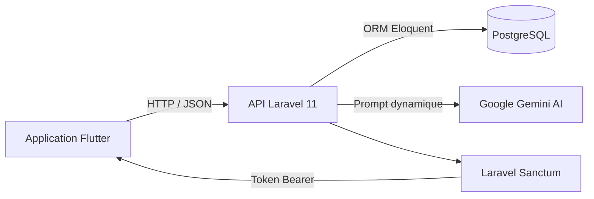

# Rapport de développement — BKN Wallet

**Projet académique — Application Mobile de Néobanque**
**Stack :** Flutter · Laravel 11 · PostgreSQL · Docker · Google Gemini AI
**Date de rendu :** Avril 2026

---

## 1. Contexte et objectifs initiaux

Le point de départ de ce projet était une application de référence fournie par le professeur, construite autour d'une architecture client-serveur classique : un frontend Next.js communiquant avec une API Laravel adossée à une base de données PostgreSQL. L'objectif pédagogique était clair — maîtriser le développement full-stack en contexte mobile — mais le choix du frontend était libre.

Plutôt que de reprendre le frontend Next.js tel quel, j'ai choisi de développer l'interface cliente en **Flutter**, un framework mobile natif de Google, afin d'aboutir à une vraie application mobile installable sur Android. Ce choix impliquait de tout comprendre par soi-même, du protocole de communication entre l'émulateur et le serveur jusqu'aux subtilités de la gestion d'état asynchrone en Dart.

Les objectifs fixés en début de projet étaient les suivants :

- Construire une API RESTful sécurisée avec Laravel et Laravel Sanctum.
- Développer une application Flutter fonctionnelle connectée à cette API en temps réel.
- Implémenter une logique bancaire complète : gestion de solde, transferts, sous-comptes (Pockets) et historique des transactions.
- Intégrer un marché de cryptomonnaie interne avec graphiques dynamiques.
- Concevoir une interface moderne et soignée, en Dark Mode, inspirée des standards des néobanques comme Revolut.
- Intégrer un assistant financier propulsé par l'IA (Google Gemini), capable de répondre à des questions contextuelles sur le compte de l'utilisateur.

---

## 2. Étapes de développement

### Phase 1 — Analyse de l'architecture et configuration initiale 

Le projet a débuté par une phase de compréhension de l'architecture globale. Il a fallu assimiler le rôle de chaque couche : Flutter envoie des requêtes HTTP, Laravel les traite via ses contrôleurs, PostgreSQL stocke les données. Cette séparation des responsabilités, bien que conceptuellement simple, était nouvelle dans un contexte mobile.

Une fois l'architecture comprise, l'environnement de développement a été mis en place : création de la base de données PostgreSQL, initialisation du projet Laravel, configuration d'Android Studio et génération du projet Flutter. La configuration du fichier `.env` de Laravel pour pointer vers PostgreSQL, ainsi que la création des premières migrations (ajout des colonnes `prenom`, `telephone`, `solde` à la table `users`), ont constitué les premières vraies contributions au code.

> **Choix technique :** Les migrations Laravel ont été préférées à la manipulation directe de SQL dans pgAdmin. Elles permettent de versionner la structure de la base de données exactement comme on versionne du code source avec Git — un principe qualifié de *"Git pour base de données"*.

### Phase 2 — Authentification et premiers tests API 

L'installation de **Laravel Sanctum** a marqué le début de la sécurisation de l'API. La configuration du trait `HasApiTokens` dans le modèle `User`, la rédaction du `AuthController` (inscription et connexion) et la définition des routes dans `api.php` ont permis d'obtenir un premier système d'authentification fonctionnel par token.

Le premier test réel de l'API a eu lieu via **Thunder Client** (extension VS Code), après avoir résolu un conflit de port qui empêchait `php artisan serve` de démarrer sur le port 8000. Ce premier test couronné de succès — un utilisateur créé en base, un token retourné — a constitué un jalon important : le backend était vivant.

### Phase 3 — Développement Flutter et connexion à l'API 

Cette phase, la plus longue, a consisté à construire l'application mobile et à la brancher sur l'API réelle. Le modèle `User` Dart a été créé, le service `api_service.dart` configuré pour les appels HTTP, et les écrans de connexion et d'inscription intégrés avec stockage du token via `SharedPreferences`.

En parallèle, la logique métier côté Laravel a été enrichie : création des modèles `Transaction` et `Pocket`, implémentation des contrôleurs associés, et mise en place des routes pour les transferts, le rechargement de solde, et les opérations sur le marché BKN.

> **Choix technique :** Flutter a été choisi pour sa capacité à produire une application native performante à partir d'une seule base de code. Le package `http` de Dart a été utilisé pour les appels réseau, et `fl_chart` pour les graphiques dynamiques du marché crypto.

### Phase 4 — Migration vers Docker 

À mi-parcours, une migration de l'environnement local vers une infrastructure **Docker** a été entreprise. L'idée initiale d'installer Nginx manuellement sur Windows a rapidement été abandonnée au profit d'une approche conteneurisée avec un fichier `compose.yaml` orchestrant trois services : `app` (PHP-FPM), `nginx` et `db` (PostgreSQL).

Cette transition a nécessité de résoudre des conflits entre les services Windows locaux et les ports réservés par Docker, notamment le port 5432 déjà occupé par l'installation locale de PostgreSQL.

### Phase 5 — Redesign UI/UX et intégration IA 

La dernière phase a été consacrée à deux axes majeurs. D'abord, un **redesign complet de l'interface** Flutter, s'inspirant des codes visuels des néobanques modernes : thème sombre (`bgDark`), accents émeraude, navigation par onglets, modales interactives pour les paramètres et la sécurité.

Ensuite, l'intégration de l'**assistant IA "Agent-BKN"** propulsé par Google Gemini. Le mécanisme repose sur un *prompt dynamique* construit côté Laravel : avant chaque appel à l'API Gemini, le backend récupère le contexte complet de l'utilisateur (soldes, liste des Pockets, historique récent) et l'injecte dans le prompt système. L'IA dispose ainsi des données nécessaires pour répondre à des questions précises du type *"Combien me reste-t-il sur mon compte Épargne ?"*.

---

## 3. Difficultés rencontrées et solutions

### Difficulté 1 — Le mur réseau : localhost vs émulateur Android

**Problème :** Le serveur Laravel tournait sur l'ordinateur de développement (`localhost:8000`), mais l'émulateur Android, étant une machine virtuelle distincte, interprète `localhost` comme lui-même.

**Impact :** Aucune connexion réseau possible entre l'application Flutter et l'API, bloquant toute progression côté mobile.

**Solution :** Utilisation de l'adresse IP `10.0.2.2`, qui est l'alias réservé par Android pour désigner la machine hôte. Pour les tests sur appareil physique, remplacement par l'adresse IPv4 locale du PC sur le réseau Wi-Fi.

**Leçon :** Comprendre la topologie réseau d'un environnement de développement mobile est fondamental avant de commencer à coder les appels API.

---

### Difficulté 2 — Conflits de ports lors de la migration Docker

**Problème :** Au démarrage de Docker Compose, le port 5432 était déjà occupé par l'installation native de PostgreSQL sous Windows.

**Impact :** Impossibilité de démarrer le conteneur de base de données, bloquant toute l'infrastructure.

**Solution :** Arrêt du service PostgreSQL Windows via le gestionnaire de services, laissant le port libre pour le conteneur Docker.

**Leçon :** La conteneurisation exige une gestion rigoureuse des ports. Il est préférable de désactiver les services locaux redondants dès le passage à Docker.

---

### Difficulté 3 — Gestion asynchrone et crash des modales Flutter

**Problème :** Lors de la soumission de formulaires dans les modales de paramètres, l'application crashait avec une erreur liée à l'*Async Gap* : une opération `await` se terminait après que l'utilisateur avait fermé la modale, et le code tentait de modifier un widget qui n'existait plus dans l'arbre.

**Impact :** L'écran de paramètres était inutilisable, avec des crashs aléatoires difficiles à reproduire.

**Solution :** Ajout systématique du guard `if (!context.mounted) return;` après chaque `await`, et encapsulation des états dans des `StatefulBuilder` pour isoler les mises à jour locales.

**Leçon :** La programmation asynchrone en Flutter requiert une vigilance constante sur le cycle de vie des widgets. Ce pattern est une bonne pratique à appliquer par défaut.

---

### Difficulté 4 — MassAssignmentException dans Laravel

**Problème :** Lors de la création de transactions, Laravel levait une `MassAssignmentException` sur les colonnes `sender_id` et `recipient_id`.

**Impact :** Impossibilité d'enregistrer une transaction en base, rendant la fonctionnalité de transfert non opérationnelle.

**Solution :** Ajout explicite de ces colonnes dans le tableau `$fillable` du modèle `Transaction.php`.

**Leçon :** Le mécanisme de protection contre l'assignation massive de Laravel est une mesure de sécurité, pas un bug. Tout nouveau champ destiné à être rempli programmatiquement doit être déclaré explicitement.

---

### Difficulté 5 — Intégration de l'API Google Gemini

**Problème :** Deux obstacles successifs ont bloqué l'intégration IA. D'abord, un problème de formatage du payload JSON envoyé à l'API Google (structure mal formée). Ensuite, une restriction géographique de l'API Gemini, inaccessible depuis certaines régions européennes, retournant l'erreur `User location is not supported`.

**Impact :** L'assistant IA était complètement non fonctionnel, représentant une fonctionnalité différenciante majeure du projet.

**Solution :** Correction du format d'envoi en fusionnant les instructions système dans une seule chaîne de texte compatible avec l'API. Pour la restriction géographique, utilisation d'un VPN localisé aux États-Unis lors des tests et des démonstrations.

**Leçon :** L'intégration d'APIs tierces nécessite de tester d'abord hors du cadre applicatif (par exemple via Thunder Client) pour isoler les problèmes de format avant de les intégrer dans le code.

---

## 4. Fonctionnalités finales de l'application

### Produit final

L'application **BKN Wallet** est une néobanque mobile hybride permettant la gestion simultanée d'un solde en euros et d'un portefeuille en cryptomonnaie interne (BKN).

### Fonctionnalités clés

| Fonctionnalité | Description |
|---|---|
| Authentification | Inscription / connexion sécurisée via tokens Sanctum |
| Dashboard | Solde EUR et BKN en temps réel |
| Transferts | Envoi de fonds entre utilisateurs enregistrés |
| Pockets | Création et alimentation de sous-comptes budgétaires |
| Marché BKN | Achat et vente de crypto avec graphiques `fl_chart` |
| Historique | Liste paginée des transactions avec filtres |
| Agent-BKN | Assistant IA contextuel (Google Gemini Flash) |
| Paramètres | Modification du mot de passe, Dark Mode natif |

### Architecture applicative

### User stories principales

- *En tant qu'utilisateur*, je peux créer un compte et me connecter de façon sécurisée.
- *En tant qu'utilisateur*, je peux consulter mes soldes EUR et BKN depuis le tableau de bord.
- *En tant qu'utilisateur*, je peux créer un Pocket "Vacances" et y transférer 200 € de mon compte principal.
- *En tant qu'utilisateur*, je peux acheter des jetons BKN et voir mon solde EUR se déduire instantanément.
- *En tant qu'utilisateur*, je peux demander à l'Agent-BKN combien il me reste sur chacun de mes Pockets.

---

## 5. Tests et validation

### Méthode de test

Les tests ont été conduits de façon incrémentale à chaque étape du développement, selon une approche proche du *test as you go* :

- **Tests API manuels** via Thunder Client (VS Code) : chaque route (`/register`, `/login`, `/transfer`, `/pockets`) a été testée individuellement en vérifiant les codes HTTP retournés (200, 201, 401, 422) et la structure des réponses JSON avant toute intégration côté Flutter.
- **Tests d'intégration Flutter** : chaque écran a été validé sur émulateur Android, en vérifiant la cohérence entre l'action utilisateur et la mise à jour de la base de données (vérification directe dans pgAdmin).
- **Tests de régression** : après chaque redesign ou refactoring majeur, un scénario de bout en bout a été rejoué (inscription → connexion → transfert → achat BKN → consultation IA).
- **Tests réseau** : validation sur appareil physique (WiFi) pour confirmer le bon fonctionnement hors émulateur.

### Résultats

Toutes les fonctionnalités core ont été validées avec succès dans un environnement conteneurisé Docker. Les temps de réponse de l'API en local se situent en dessous de 200 ms pour les opérations standards. L'assistant IA répond correctement aux questions contextuelles lorsque la disponibilité géographique de l'API Gemini le permet.

---

## 6. Améliorations possibles

**Notifications push** — Intégrer Firebase Cloud Messaging (FCM) pour alerter l'utilisateur en temps réel lors de la réception d'un virement ou d'un franchissement de seuil sur un Pocket.

**Tests automatisés** — Écrire des tests unitaires Laravel (PHPUnit) pour les contrôleurs critiques (transferts, pockets) et des widget tests Flutter pour les formulaires d'authentification, afin de sécuriser les évolutions futures.

**Déploiement cloud** — Migrer l'infrastructure Docker vers un service cloud (Railway, Render ou un VPS) pour rendre l'application accessible en dehors du réseau local, ce qui faciliterait les tests sur appareil physique et les démonstrations.

**Taux de change dynamique** — Connecter le marché BKN à une API de prix externe (ex : CoinGecko) plutôt que d'utiliser un prix simulé, pour donner plus de réalisme au simulateur de trading.

**Internationalisation** — Ajouter le support multilingue (français / anglais) via le package `flutter_localizations`, ce qui rendrait l'application déployable dans différents contextes géographiques.

---

## 7. Conclusion

Ce projet a permis de développer une application mobile full-stack complète et fonctionnelle, couvrant l'ensemble du cycle : conception de la base de données, API sécurisée, interface mobile native et intégration d'intelligence artificielle. Il a mis en lumière les défis concrets du développement distribué — communication réseau, synchronisation des services, gestion d'état asynchrone — et la valeur d'une infrastructure conteneurisée pour garantir la reproductibilité d'un environnement. Le résultat, BKN Wallet, est un produit cohérent et ambitieux dont je suis fière, qui va bien au-delà des objectifs académiques initiaux en proposant une expérience utilisateur proche des standards de l'industrie.

